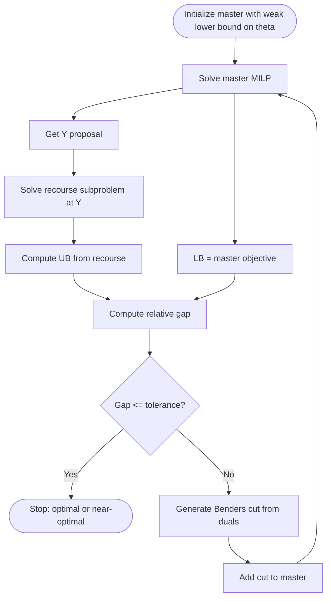
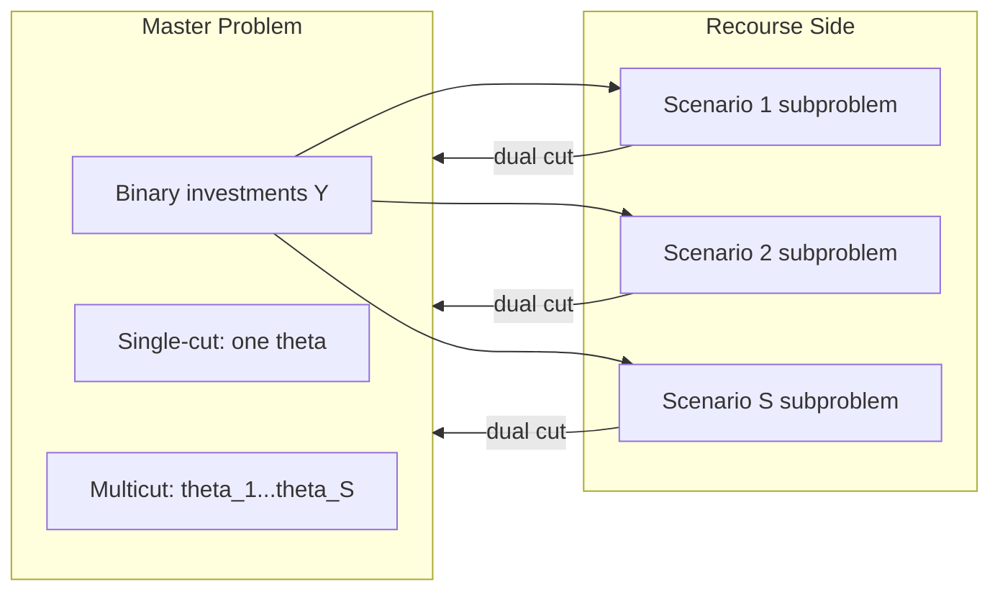

# Benders Decomposition and Multicut Benders

## A Beginner-Friendly Theory and Implementation Guide with SFCTP

---

> Who is this for?  
> You already know LP/MIP and duality, but you are learning decomposition methods for the first time. This note explains Benders Decomposition from intuition to equations to implementation, using the project files as concrete examples.

---

## Table of Contents

1. [Why Benders Decomposition?](#1-why-benders-decomposition)
2. [The SFCTP Structure That Makes Benders Work](#2-the-sfctp-structure-that-makes-benders-work)
3. [Classical Benders Decomposition (Single-Cut)](#3-classical-benders-decomposition-single-cut)
4. [Cut Derivation in the Model](#4-cut-derivation-in-the-model)
5. [Algorithm Flow](#5-algorithm-flow)
6. [Implementation Walkthrough: Single-Cut File](#6-implementation-walkthrough-single-cut-file)
7. [Multicut Extension: Why and How](#7-multicut-extension-why-and-how)
8. [Implementation Walkthrough: Multicut File](#8-implementation-walkthrough-multicut-file)
9. [Single-Cut vs Multicut: Practical Trade-Offs](#9-single-cut-vs-multicut-practical-trade-offs)
10. [Tips, Pitfalls, and Performance Improvements](#10-tips-pitfalls-and-performance-improvements)
11. [Verified References](#11-verified-references)

---

## 1. Why Benders Decomposition?

When a model has:

1. A relatively small set of difficult first-stage variables (often binary/integer), and
2. A large continuous recourse part that depends on those first-stage decisions,

Benders Decomposition can be very effective.

Instead of solving one large mixed-integer model directly, we alternate between:

1. A first-stage master problem over investment variables, and
2. A subproblem (or set of subproblems) that evaluates and cuts the current first-stage proposal.

In the example case, this structure appears naturally in the stochastic fixed-charge transportation problem:

1. First stage: invest in arcs, binary variables $Y_{ij}$.
2. Second stage: for each scenario, route flow and shortage slack $(X^s, Z^s)$.

---

## 2. The SFCTP Structure That Makes Benders Work

The extensive stochastic model is:

$$
\min_{Y,X,Z} \; \sum_{i,j} F_{ij}Y_{ij} + \sum_{s} p_s\left(\sum_{i,j} C_{ij}X_{ij}^s + \kappa\sum_j Z_j^s\right)
$$

subject to, for each scenario $s$:

$$
\sum_j X_{ij}^s \le A_i, \quad
\sum_i X_{ij}^s \ge B_{sj} - Z_j^s, \quad
X_{ij}^s \le U_{sij}Y_{ij}, \quad
U_{sij} = \min(A_i, B_{sj})
$$

and $Y_{ij}\in\{0,1\}, X_{ij}^s\ge0, Z_j^s\ge0$.

The only coupling between first and second stage is in the right-hand side of
$X_{ij}^s \le U_{sij}Y_{ij}$.
That is exactly the pattern Benders exploits.

Important practical detail in the example model: shortage slack $Z$ with penalty $\kappa=100$ makes subproblems always feasible, so the algorithm needs only optimality cuts (no feasibility cuts).

---

## 3. Classical Benders Decomposition (Single-Cut)

Define the recourse value function

$$
Q(Y) = \min_{X,Z}\; \sum_s p_s\left(\sum_{i,j} C_{ij}X_{ij}^s + \kappa\sum_j Z_j^s\right)
\quad \text{subject to recourse constraints given }Y
$$

Then the problem becomes

$$
\min_Y\; \sum_{i,j} F_{ij}Y_{ij} + Q(Y), \quad Y\in\{0,1\}^{I\times J}
$$

Master approximation introduces a variable $\theta$ such that $\theta\ge Q(Y)$:

$$
\min_{Y,\theta}\; \sum_{i,j}F_{ij}Y_{ij} + \theta
$$

At each iteration, we solve the master, obtain $\bar{Y}$, solve recourse at $\bar{Y}$, and add a cut that underestimates $Q(Y)$ globally but is exact at $\bar{Y}$.

This is the single-cut implementation in [SFCTP-BD.jl](SFCTP-BD.jl).

---

## 4. Cut Derivation in the Model

For a current proposal $\bar{Y}$, the subproblem dual gives multipliers on the linking constraints:

$$
X_{ij}^s \le U_{sij}\bar{Y}_{ij}, \quad U_{sij}=\min(A_i,B_{sj})
$$

Call these dual multipliers $\pi_{sij}$ (in code: `p_dual = dual.(subproblem[:FlowLimit])`).

Using dual sensitivity, one valid Benders optimality cut is:

$$
\theta \ge Q(\bar{Y}) + \sum_{s,i,j} \left(-\pi_{sij}U_{sij}\right)(\bar{Y}_{ij} - Y_{ij})
$$

This is algebraically the same structure as the code in [SFCTP-BD.jl](SFCTP-BD.jl), function `add_cut!`.

Why this is valid:

1. $Q(Y)$ is convex and piecewise linear in continuous relaxations of $Y$.
2. Dual multipliers define a supporting hyperplane.
3. The cut touches at $Y=\bar{Y}$ and lower-bounds $Q(Y)$ elsewhere.

---

## 5. Algorithm Flow

Bound logic in the code:

1. Lower bound: current master objective.
2. Upper bound: best known feasible value built with current recourse evaluation.

This is logged each iteration and plotted.

---

## 6. Implementation Walkthrough: Single-Cut File

Main mapping in [SFCTP-BD.jl](SFCTP-BD.jl):

1. `create_first_stage_model`:
   1. Binary $Y$ and one surrogate variable $\theta$.
   2. Objective $\sum F\,Y + \theta$.
2. `create_and_solve_subproblem`:
   1. Solves all scenarios together in one recourse LP.
   2. Uses fixed proposal `Y_proposal`.
3. `add_cut!`:
   1. Reads duals from `FlowLimit` constraints.
   2. Adds one aggregated cut for all scenarios.
4. `benders_decomposition!`:
   1. Master solve -> recourse solve -> bounds -> gap -> cut loop.

Conceptually, this is the classic L-shaped idea specialized to the mixed-integer first stage.

---

## 7. Multicut Extension: Why and How

In single-cut Benders, one iteration adds one cut approximating total expected recourse $Q(Y)$.

In multicut Benders, we decompose:

$$
Q(Y) = \sum_s p_s Q_s(Y)
$$

and keep one variable per scenario in the master, $\theta_s \approx Q_s(Y)$:

$$
\min_{Y,\theta_s} \sum_{i,j}F_{ij}Y_{ij} + \sum_s p_s\theta_s
$$

For each scenario $s$, add scenario-specific cut:

$$
\theta_s \ge Q_s(\bar{Y}) + \sum_{i,j} g_{sij}(\bar{Y}_{ij}-Y_{ij})
$$

where $g_{sij}$ comes from that scenario dual multipliers.

Why it helps:

1. Finer approximation of recourse function.
2. Usually tighter lower bound per iteration.
3. Often fewer iterations.

Why it can hurt:

1. More cuts and larger master problem.
2. Higher memory and per-iteration master solve time.

---

## 8. Implementation Walkthrough: Multicut File

The multicut version in [SFCTP-BD-multicut.jl](SFCTP-BD-multicut.jl) does exactly this.

Key differences versus single-cut:

1. Master variables:
   1. Single-cut: one `theta`.
   2. Multicut: `theta[s=1:S]`.
2. Objective:
   1. Single-cut: fixed cost + `theta`.
   2. Multicut: fixed cost + $\sum_s p_s\theta_s$.
3. Subproblems:
   1. Single-cut: one LP containing all scenarios.
   2. Multicut: one LP per scenario (dictionary `subproblem[s]`).
4. Cut generation:
   1. Single-cut: one aggregated cut each iteration.
   2. Multicut: one cut per scenario each iteration.

This is exactly the standard multicut extension from stochastic programming literature.

---

## 9. Single-Cut vs Multicut: Practical Trade-Offs

| Aspect | Single-Cut | Multicut |
|---|---|---|
| Cuts added per iteration | 1 | $S$ |
| Master size growth | Slower | Faster |
| Typical iterations to converge | More | Fewer |
| Per-iteration master complexity | Lower | Higher |
| Best use case | Few scenarios, cheap recourse | Many heterogeneous scenarios |

Rule of thumb:

1. Start with multicut when scenarios are very different and recourse dominates runtime.
2. Start with single-cut when master MILP is already hard and scenario count is modest.
3. Benchmark both on representative instances.

---

## 10. Tips, Pitfalls, and Performance Improvements

### 10.1 Modeling and numerical tips

1. Keep a meaningful lower bound on theta values.
   1. We use `M = -10000` to prevent unbounded master early.
   2. Better: derive a tighter bound if possible to improve numerics.
2. Always check dual availability before using duals for cuts.
   1. The assertion `is_solved_and_feasible(...; dual=true)` is correct.
3. Use relative gap with guard when UB is close to zero.

### 10.2 Algorithmic improvements

1. Pareto-optimal cuts (Magnanti-Wong strategy) can significantly reduce iterations.
2. Cut management:
   1. Remove weak inactive cuts occasionally.
   2. Keep only cuts active at recent incumbent/master solutions.
3. Stabilization:
   1. Regularize master updates to reduce oscillation in $Y$.
4. Parallelization for multicut:
   1. Scenario subproblems are independent and can be solved in parallel.

### 10.3 Common beginner mistakes

1. Forgetting feasibility cuts when recourse can be infeasible.
   1. In the model this is avoided because shortage slack ensures feasibility.
2. Mixing dual signs incorrectly when forming cuts.
3. Using integer recourse in subproblem while expecting valid linear Benders cuts from LP duality.

### 10.4 Interpretation of convergence plots

1. Lower bound should be nondecreasing.
2. Upper bound should be nonincreasing (best-so-far incumbent value).
3. Gap should trend to zero.

If not, inspect cut formula signs and bound updates first.

---

## 11. References

The references below are standard references.

### Foundational

- Benders, J. F. (1962). Partitioning procedures for solving mixed-variables programming problems. Numerische Mathematik, 4, 238-252.
- Van Slyke, R. M., & Wets, R. (1969). L-shaped linear programs with applications to optimal control and stochastic programming. SIAM Journal on Applied Mathematics, 17(4), 638-663.
- Geoffrion, A. M. (1972). Generalized Benders decomposition. Journal of Optimization Theory and Applications, 10(4), 237-260.

### Stochastic programming and multicut

- Birge, J. R., & Louveaux, F. (1988). A multicut algorithm for two-stage stochastic linear programs. Operations Research, 36(1), 101-117.
- Birge, J. R., & Louveaux, F. (2011). Introduction to Stochastic Programming (2nd ed.). Springer.
- Shapiro, A., Dentcheva, D., & Ruszczynski, A. (2009). Lectures on Stochastic Programming: Modeling and Theory (2nd ed.). SIAM.

### Acceleration and practical guidance

- Magnanti, T. L., & Wong, R. T. (1981). Accelerating Benders decomposition: Algorithmic enhancement and model selection criteria. Operations Research, 29(3), 464-484.
- Rahmaniani, R., Crainic, T. G., Gendreau, M., & Rei, W. (2017). The Benders decomposition algorithm: A literature review. European Journal of Operational Research, 259(3), 801-817.

---

## Appendix A: Master/Subproblem Diagram for Single-Cut and Multicut

---

Companion code files:

1. Single-cut Benders: [SFCTP-BD.jl](SFCTP-BD.jl)
2. Multicut Benders: [SFCTP-BD-multicut.jl](SFCTP-BD-multicut.jl)
3. Baseline stochastic model: [SFCTP.jl](SFCTP.jl)
