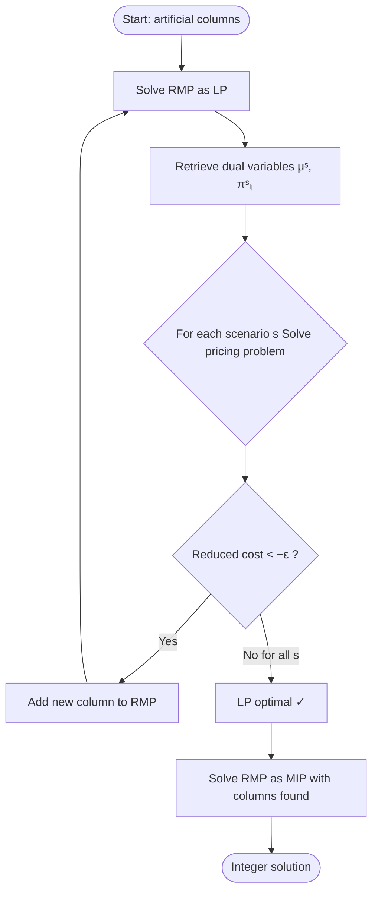
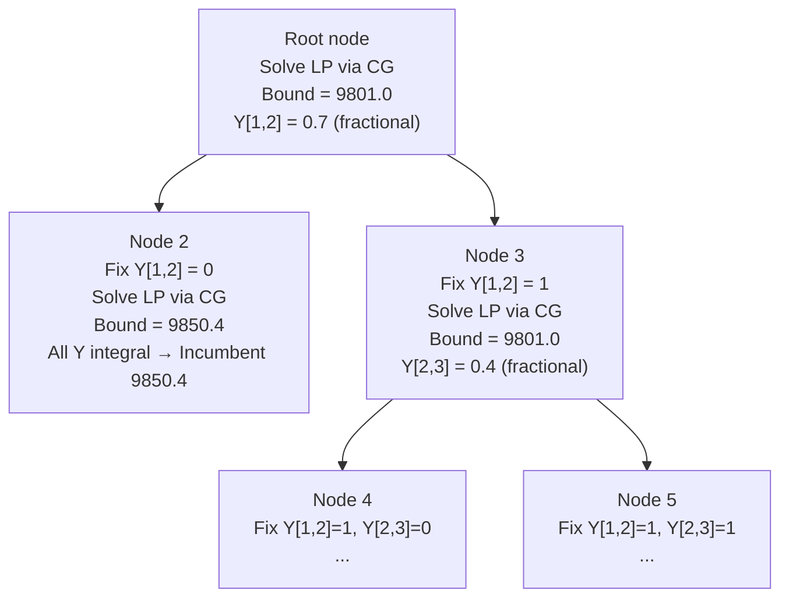
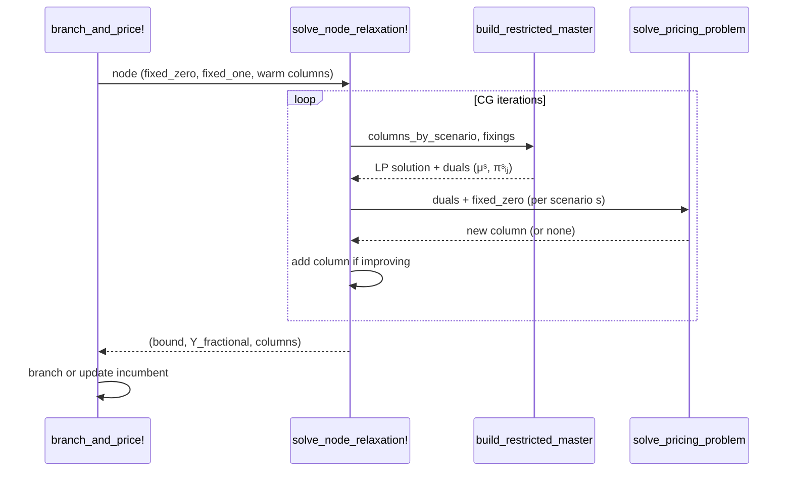

# Column Generation and Branch-and-Price

## A Practical Introduction with the Stochastic Fixed-Charge Transportation Problem

---

> **Who is this for?**  
> You are comfortable with linear programming (LP), integer programming (IP), duality, and branch-and-bound. You have never seen column generation (CG) or branch-and-price (B&P) before, and you want a self-contained explanation that goes from the intuition all the way to working Julia code.

---

## Table of Contents

1. [Motivation — When LP is Too Wide to Solve Directly](#1-motivation)
2. [The Running Example: SFCTP](#2-the-running-example-sfctp)
3. [Dantzig-Wolfe Reformulation](#3-dantzig-wolfe-reformulation)
4. [Column Generation](#4-column-generation)
5. [The Restricted Master Problem (RMP)](#5-the-restricted-master-problem)
6. [The Pricing Problem](#6-the-pricing-problem)
7. [Putting It Together: the CG Loop](#7-putting-it-together-the-cg-loop)
8. [From CG to Integer Solutions: Branch-and-Price](#8-branch-and-price)
9. [Implementation Walkthrough](#9-implementation-walkthrough)
10. [Tips, Pitfalls, and Best Practices](#10-tips-pitfalls-and-best-practices)
11. [Further Reading and References](#11-further-reading-and-references)

---

## 1. Motivation

Many real optimization problems have an enormous number of **variables** (columns in the constraint matrix), yet the optimal LP solution uses only a handful of them. This is not a coincidence — it follows directly from the simplex method: every basic feasible solution has at most $m$ non-zero variables (where $m$ is the number of constraints). If there are $n \gg m$ variables, almost all of them are zero at optimality.

**Column generation** exploits this observation: instead of loading all $n$ columns into the model upfront, start with a small *restricted* set and add only the columns that can actually improve the objective. The columns are generated on demand by solving an auxiliary optimisation called the **pricing problem**.

> **Classic example:** The cutting-stock problem (Gilmore & Gomory, 1961) has one column for every distinct cutting pattern. With a 100-unit roll and items of width 1, there are exponentially many patterns. CG solved it in seconds when the LP with all patterns was intractable.

When the original problem is a **mixed-integer program (MIP)**, CG alone is not enough because LP relaxations may have fractional solutions. **Branch-and-price (B&P)** embeds CG inside a branch-and-bound tree, running a fresh CG loop at every node to tighten the LP bound before branching. This is the gold-standard approach for huge structured IPs (Barnhart et al., 1998).

---

## 2. The Running Example: SFCTP

The **Stochastic Fixed-Charge Transportation Problem (SFCTP)** models a two-stage logistics decision:

| Stage | Decision | Timing |
|-------|----------|--------|
| First | Open arcs $Y_{ij} \in \{0,1\}$ | Before demand is revealed |
| Second | Route flow $X_{ij}^s \geq 0$ | After scenario $s$ is revealed |

### Sets and parameters

| Symbol | Meaning |
|--------|---------|
| $i \in \mathcal{I}$ | Origins (suppliers), $\|\mathcal{I}\|=I$ |
| $j \in \mathcal{J}$ | Destinations (customers), $\|\mathcal{J}\|=J$ |
| $s \in \mathcal{S}$ | Scenarios, $\|\mathcal{S}\|=S$ |
| $A_i$ | Supply capacity at origin $i$ |
| $B_{sj}$ | Demand at destination $j$ under scenario $s$ |
| $C_{ij}$ | Unit flow cost on arc $(i,j)$ |
| $F_{ij}$ | Fixed cost to open arc $(i,j)$ |
| $p_s$ | Probability of scenario $s$ |
| $\kappa$ | Non-supplied demand penalty (= 100) |

### Extensive-form formulation

$$\min_{Y, X, Z} \quad \underbrace{\sum_{i,j} F_{ij} Y_{ij}}_{\text{first-stage cost}} + \underbrace{\sum_{s} p_s \left( \sum_{i,j} C_{ij} X_{ij}^s + \kappa \sum_{j} Z_j^s \right)}_{\text{expected second-stage cost}}$$

Subject to:

$$\sum_{j} X_{ij}^s \leq A_i \qquad \forall s, i \tag{supply}$$

$$\sum_{i} X_{ij}^s \geq B_{sj} - Z_j^s \qquad \forall s, j \tag{demand}$$

$$X_{ij}^s \leq \min(A_i, B_{sj})\, Y_{ij} \qquad \forall s, i, j \tag{linking}$$

$$Y_{ij} \in \{0,1\}, \quad X_{ij}^s \geq 0, \quad Z_j^s \geq 0$$

The **linking constraint** is the structural difficulty: it couples the first-stage binary variables $Y$ with every scenario's flow variables. This is precisely the coupling that CG will exploit.

### Sample instance

The code uses $I=4$, $J=3$, $S=3$ (12 binary $Y$ variables, 36 continuous $X$ variables, 9 slack variables). The extensive-form optimum is **440.1** with

$$Y^* = \begin{pmatrix} 1 & 0 & 1 \\ 0 & 1 & 1 \\ 1 & 1 & 0 \\ 0 & 0 & 1 \end{pmatrix}$$

This instance is small enough to solve directly, but it perfectly illustrates every step of CG and B&P.

---

## 3. Dantzig-Wolfe Reformulation

The key insight is to **decompose by scenario**: each scenario's subproblem (given fixed $Y$) is an independent transportation LP. We reformulate by enumerating the extreme points of each scenario's feasible region.

### The scenario subproblem

Fix $Y$ and look at scenario $s$. The feasible set of $(X^s, Z^s)$ satisfying the supply, demand, and linking constraints is a bounded polyhedron $\mathcal{P}_s(Y)$. By the representation theorem, any feasible point is a convex combination of its extreme points $\{(X^{s,k}, Z^{s,k})\}_{k}$.

We introduce a **column** for each extreme point of each scenario's feasible region, together with its associated arc-opening decisions $Y^{s,k}$:

$$\text{Column } k \text{ for scenario } s: \quad \left(Y^{s,k},\; X^{s,k},\; Z^{s,k},\; q^{s,k}\right)$$

where $q^{s,k} = \sum_{i,j} C_{ij} X_{ij}^{s,k} + \kappa \sum_j Z_j^{s,k}$ is the operating cost of that extreme point.

### Master problem (Dantzig-Wolfe)

Replace $(X^s, Z^s)$ by convex combinations $\lambda^{s,k} \geq 0$:

$$\min_{Y, \lambda} \quad \sum_{i,j} F_{ij} Y_{ij} + \sum_{s} p_s \sum_{k} q^{s,k} \lambda^{s,k}$$

$$\sum_{k} \lambda^{s,k} = 1 \qquad \forall s \tag{convexity}$$

$$Y_{ij} \geq \sum_{k} Y_{ij}^{s,k} \lambda^{s,k} \qquad \forall s, i, j \tag{linking}$$

$$\lambda^{s,k} \geq 0, \quad Y_{ij} \in \{0,1\}$$

> **Why is this useful?** The master problem has far *fewer constraints* than the extensive form — only $S$ convexity constraints plus $S \cdot I \cdot J$ linking constraints. Its downside is that it has exponentially many *variables* (one $\lambda$ per extreme point of each $\mathcal{P}_s$). Column generation manages this by working with a small subset at a time.

---

## 4. Column Generation

Column generation is an iterative procedure to solve the LP relaxation of the master problem **without enumerating all columns**.

### Core idea

At each iteration:

1. Solve the **Restricted Master Problem (RMP)**: the LP relaxation with only the current subset of columns.
2. Use the RMP dual variables to check if any column outside the current set can **improve** the objective (negative reduced cost).
3. If yes, add the best such column and repeat. If no such column exists, the current LP solution is optimal for the *full* master LP.

### Optimality condition

For a minimisation problem, a column $k$ of scenario $s$ has reduced cost

$$\bar{c}^{s,k} = p_s q^{s,k} + \sum_{i,j} \pi_{ij}^s Y_{ij}^{s,k} - \mu^s$$

where $\mu^s$ is the dual of the convexity constraint and $\pi_{ij}^s$ is the dual of the linking constraint for arc $(i,j)$ in scenario $s$.

The LP is optimal when $\bar{c}^{s,k} \geq 0$ for all $s$ and all (implicitly defined) columns $k$. Equivalently, for each $s$:

$$\min_{k} \bar{c}^{s,k} = \min_{Y^{s,k}, X^{s,k}, Z^{s,k}} \left[ p_s q^{s,k} + \sum_{i,j} \pi_{ij}^s Y_{ij}^{s,k} - \mu^s \right] \geq 0$$

This minimisation *is* the pricing problem.

---

## 5. The Restricted Master Problem

The Restricted Master Problem (RMP) keeps only a working set of columns $\mathcal{K}_s \subseteq \{1,\ldots,|\mathcal{P}_s|\}$ for each scenario. It is solved as a continuous LP (all $\lambda$ relaxed to $[0,1]$, $Y$ relaxed to $[0,1]$).

### Initialisation: artificial columns

Before any real columns are available, we need a feasible starting point. The standard trick is to add one **artificial column** per scenario that supplies all demand via non-supply slack at the maximum penalty:

$$\text{Artificial column for } s: \quad Y^{s,\text{art}} = \mathbf{0},\; X^{s,\text{art}} = \mathbf{0},\; Z^{s,\text{art}} = B_{s\cdot},\; q^{s,\text{art}} = \kappa \sum_j B_{sj}$$

This column is always feasible (it pays the full non-supply penalty for all demand). The RMP is feasible from iteration 1.

In the code:

```julia
function build_artificial_column(I, J, demand)
    return ScenarioColumn(
        zeros(I, J),       # no arcs opened
        zeros(I, J),       # no flow
        Float64.(vec(demand)),  # all demand is unmet
        NSD_COST * sum(demand), # worst-case cost
    )
end
```

### RMP structure in JuMP

```julia
function build_restricted_master(I, J, S, F, P, columns_by_scenario; relax_integrality = true)
    model = Model(HiGHS.Optimizer)

    # Y is continuous [0,1] during CG; Bin in the final integer solve
    @variable(model, 0 <= Y[1:I, 1:J] <= 1)

    # One lambda per column per scenario
    lambda = [[@variable(model, lower_bound = 0) for _ in cols] for cols in columns_by_scenario]

    @objective(model, Min,
        sum(F[i,j] * Y[i,j] for i=1:I, j=1:J) +
        sum(P[s] * columns_by_scenario[s][k].cost * lambda[s][k]
            for s=1:S, k in eachindex(columns_by_scenario[s]))
    )

    # Convexity constraints — duals become μˢ
    convexity = @constraint(model, [s=1:S], sum(lambda[s]) == 1)

    # Linking constraints — duals become πˢᵢⱼ
    link = @constraint(model, [s=1:S, i=1:I, j=1:J],
        Y[i,j] >= sum(columns_by_scenario[s][k].y[i,j] * lambda[s][k]
                      for k in eachindex(columns_by_scenario[s]))
    )
    return (; model, Y, lambda, convexity, link)
end
```

> **Tip — dual sign convention:** In a `>=` constraint, the dual is $\leq 0$ at optimality in a minimisation. In JuMP with HiGHS the sign is handled automatically; just use `dual(constraint)` directly in the pricing objective.

---

## 6. The Pricing Problem

For each scenario $s$, the pricing problem is a small **fixed-charge transportation problem** (FCTP):

$$\min_{Y^s, X^s, Z^s} \quad p_s \left( \sum_{i,j} C_{ij} X_{ij}^s + \kappa \sum_j Z_j^s \right) + \sum_{i,j} \pi_{ij}^s Y_{ij}^s - \mu^s$$

Subject to:
$$\sum_j X_{ij}^s \leq A_i \quad \forall i, \qquad \sum_i X_{ij}^s \geq B_{sj} - Z_j^s \quad \forall j$$
$$X_{ij}^s \leq \min(A_i, B_{sj})\, Y_{ij}^s \quad \forall i,j$$
$$Y_{ij}^s \in \{0,1\}, \quad X_{ij}^s \geq 0, \quad Z_j^s \geq 0$$

The objective has a clean interpretation: it is the reduced cost of the column generated by this $(Y^s, X^s, Z^s)$.

- If the optimal value is **negative**: this column improves the master LP → add it.
- If the optimal value is **$\geq 0$**: no improving column exists for this scenario → done.

### What dual variables do

The linking-constraint duals $\pi_{ij}^s$ act as **prices** that the master charges the pricing problem for using arc $(i,j)$. When $\pi_{ij}^s$ is large and negative (the master strongly wants arc $(i,j)$ opened), the pricing problem is incentivised to open it. When it is zero or positive (the master is indifferent or penalises opening it), the pricing problem avoids it.

In code:

```julia
function solve_pricing_problem(s, I, J, A, B, C, P, convexity_dual, linking_dual)
    model = Model(HiGHS.Optimizer)
    @variable(model, 0 <= X[i=1:I, j=1:J] <= min(A[i], B[s,j]))
    @variable(model, Y[i=1:I, j=1:J], Bin)
    @variable(model, Z[j=1:J] >= 0)

    operating_cost = @expression(model,
        sum(C[i,j]*X[i,j] for i=1:I, j=1:J) + sum(NSD_COST*Z[j] for j=1:J))

    @objective(model, Min,
        P[s] * operating_cost
        + sum(linking_dual[i,j] * Y[i,j] for i=1:I, j=1:J)
        - convexity_dual   # subtract μˢ
    )
    # ... supply, demand, linking constraints ...
    optimize!(model)

    reduced_cost = objective_value(model)
    if reduced_cost < -COLUMN_TOLERANCE          # negative → improving column
        return ScenarioColumn(value.(Y), value.(X), value.(Z), value(operating_cost)),
               reduced_cost
    end
    return nothing, reduced_cost
end
```

> **Tip — COLUMN_TOLERANCE:** Comparing against exactly 0 risks adding columns with negligible reduced cost that barely change the solution and waste iterations. Use a small tolerance (e.g., `1e-6`) to gate the addition.

---

## 7. Putting It Together: the CG Loop



### Convergence

CG always converges in a finite number of iterations because:

1. The number of extreme points of each $\mathcal{P}_s$ is finite.
2. Each new column has strictly negative reduced cost, so the LP objective strictly decreases.
3. The LP has a finite optimal value.

In practice, CG can be slow near the optimum (*tailing-off effect*). The convergence criterion `new_columns == 0` in the code is exact: no improving column was found for any scenario.

### Iteration log interpretation

```shell
Iteration  LP Objective  Best Red. Cost  Columns  New Columns
        1    12345.6789   -5.2300e+02        3           3
        2    10234.1234   -1.1200e+02        6           3
       ...
       12     9801.0000   -3.1e-07           41          0
```

- **LP Objective** decreases (or stays) monotonically — a sanity check.
- **Best Red. Cost** approaches 0 from below. When it reaches 0 (within tolerance), the LP relaxation is solved.
- **New Columns = 0** triggers termination.

---

## 8. Branch-and-Price

Column generation solves the *LP relaxation* of the master. When the master is an IP (binary $\lambda$ or binary $Y$), we need integer solutions. **Branch-and-price** integrates CG into a branch-and-bound framework.

### Why can't we just round?

The LP solution of the master may be fractional in $Y$. Moreover, the column pool generated at the root node may not contain the columns needed to express an optimal integer solution at a child node. Columns must be regenerated at each node.

### The B&P tree



Each **BranchNode** stores the branching decisions made so far:

```julia
struct BranchNode
    id::Int
    depth::Int
    fixed_zero::Set{Tuple{Int,Int}}   # arcs forced closed
    fixed_one::Set{Tuple{Int,Int}}    # arcs forced open
    columns_by_scenario::Vector{Vector{ScenarioColumn}}  # warm-start columns
end
```

### Branching rule

The code branches on the arc $Y_{ij}$ with value closest to 0.5 (most fractional):

```julia
function select_branch_arc(Y)
    best_arc = nothing
    best_score = Inf
    for i in axes(Y,1), j in axes(Y,2)
        val = Y[i,j]
        if INTEGRALITY_TOLERANCE < val < 1.0 - INTEGRALITY_TOLERANCE
            score = abs(val - 0.5)   # 0 = most fractional
            if score < best_score
                best_score = score
                best_arc = (i, j, val)
            end
        end
    end
    return best_arc
end
```

> **Tip — branching rule alternatives:**  
>
> - **Most-fractional** (as above): simple and standard.  
> - **Strong branching**: solve both children's LP partially and pick the arc that gives the best bound improvement. Expensive but fewer nodes.  
> - **Pseudo-cost branching**: estimate bound improvements based on history of previous branches. Good balance.

### Pruning

A node is pruned when its LP bound $\geq$ current best incumbent:

```julia
if node_bound >= best_objective - INTEGRALITY_TOLERANCE
    println("  pruned by bound")
    continue
end
```

### Node selection

The code uses a **LIFO stack** (`pop!` from the end of `open_nodes`), which implements **depth-first search (DFS)**. DFS finds integer solutions quickly (deep in the tree) and is memory-efficient.

> **Tip — node selection strategies:**  
>
> - **DFS** (this code): fast first incumbent, low memory.  
> - **Best-first**: process lowest bound node first. Fewer nodes overall, but high memory.  
> - **Best-first with DFS dive**: hybrid — often the practical sweet spot.

### Propagating columns across nodes

When creating child nodes, the code **inherits the parent's column pool**:

```julia
child_zero = BranchNode(..., clone_columns(child_columns))
child_one  = BranchNode(..., clone_columns(child_columns))
```

This warm-starts the CG at child nodes: many useful columns are already available, so fewer pricing iterations are needed.

### How branching affects the pricing problem

Branching fixes some $Y_{ij}$ to 0 or 1. These fixings must be **propagated to the pricing problem** so that it only generates columns consistent with the current node's branching decisions:

```julia
for (i, j) in fixed_zero
    fix(Y[i, j], 0.0; force = true)   # pricing cannot open this arc
end
```

Fixed-to-one arcs are handled implicitly: the master's linking constraint forces $Y_{ij}=1$, so no pricing-problem modification is needed beyond what the duals already encode.

---

## 9. Implementation Walkthrough

### Overall structure

```txt
SFCTP-CG-B&P.jl
├── Data structures
│   ├── ScenarioColumn     — one extreme point of a scenario's subproblem
│   └── BranchNode         — one node of the B&P tree
├── Model builders
│   ├── build_restricted_master(...)   — RMP as continuous LP
│   ├── solve_pricing_problem(...)     — FCTP pricing problem
│   └── create_extensive_form_model(...) — reference MIP for validation
├── B&P components
│   ├── solve_node_relaxation!(...)    — CG loop at a single B&P node
│   └── branch_and_price!(...)         — main B&P driver
└── Script section
    ├── Solve with B&P
    └── Validate against extensive form
```

### Data flow diagram



### The full B&P loop

```julia
while !isempty(open_nodes)
    node = pop!(open_nodes)                          # LIFO = DFS
    result = solve_node_relaxation!(node, ...)       # CG at this node

    if result.bound >= best_objective                # prune by bound
        continue
    end

    if is_integral_solution(result.Y)               # integer solution
        best_objective = result.bound
        best_Y = round.(Int, result.Y)
        continue
    end

    # Branch: create two children
    (i_b, j_b, _) = select_branch_arc(result.Y)
    push!(open_nodes, child_with_Y[i_b,j_b] = 0)
    push!(open_nodes, child_with_Y[i_b,j_b] = 1)
end
```

### Column struct

```julia
struct ScenarioColumn
    y::Matrix{Float64}   # arc investments Y[i,j] for this scenario
    x::Matrix{Float64}   # flows X[i,j] for this scenario
    z::Vector{Float64}   # unmet demand Z[j] for this scenario
    cost::Float64        # operating cost q = Σ C·X + κ·Σ Z
end
```

A column encodes a complete operational decision for one scenario. The master decides *how much weight* to put on each column (via $\lambda$), balancing operating cost against the investment decisions the column requires.

---

## 10. Tips, Pitfalls, and Best Practices

### Column generation

| Issue | Symptom | Fix |
|-------|---------|-----|
| **Tailing-off** | LP objective barely moves in late iterations | Accept an $\varepsilon$-optimal LP; stabilisation techniques (e.g., dual stabilisation, bundle methods) |
| **Duplicate columns** | Wasted solver calls | Check for duplicates before adding (the `column_already_exists` function) |
| **Numerical issues in pricing** | Spurious negative reduced costs | Tighten `COLUMN_TOLERANCE`; use a more numerically stable solver |
| **Infeasible RMP** | Model crashes on first iteration | Ensure artificial columns are always feasible (they always are in this code) |
| **Degeneracy** | Cycling, no progress | Use anti-cycling rules; perturbation in the RMP |

### Branch-and-price

| Issue | Symptom | Fix |
|-------|---------|-----|
| **Many nodes** | B&P runs forever | Improve branching rule; add cutting planes |
| **Slow node LP** | CG takes many iterations at each node | Warm-start from parent columns (done in this code); limit max iterations per node |
| **Infeasible node LP** | `@assert` fails | Check that fixings are consistent; handle infeasibility gracefully by pruning |
| **Wrong duals** | Pricing adds wrong columns | Verify that fixings in the RMP use `fix()` not just bounds on $Y$ (to ensure correct duals) |
| **Forgetting to propagate fixings to pricing** | Columns violate branching decisions | Always pass `fixed_zero` (and handle `fixed_one`) to `solve_pricing_problem` |

### General advice

- **Always validate against the extensive form** on small instances (the code does this with `@assert`).
- **Relax integrality** in the RMP during CG — solving it as an IP at every CG iteration is wasteful and incorrect (you lose LP duals).
- **Re-solve as an IP** (with `relax_integrality = false`) only once CG has converged *at the root node* (the `SFCTP-CG.jl` approach) or at each B&P leaf (the `SFCTP-CG-B&P.jl` approach).
- **Sensitivity of columns to branching:** a column generated under one branching scenario may be infeasible in another. The `fixed_zero` propagation in the pricing problem prevents infeasible columns from entering the RMP.

---

## 11. Further Reading and References

The references below are standard references:

### Foundational papers

- **Dantzig, G. B., & Wolfe, P. (1960).** Decomposition principle for linear programs. *Operations Research*, 8(1), 101–111.  
  The original Dantzig-Wolfe decomposition: the theoretical foundation for the master/subproblem structure.

- **Gilmore, P. C., & Gomory, R. E. (1961).** A linear programming approach to the cutting-stock problem. *Operations Research*, 9(6), 849–859.  
  The first practical application of column generation; a must-read for historical context.

- **Barnhart, C., Johnson, E. L., Nemhauser, G. L., Savelsbergh, M. W. P., & Vance, P. H. (1998).** Branch-and-price: Column generation for solving huge integer programs. *Operations Research*, 46(3), 316–329.  
  The landmark paper that gave the name "branch-and-price" and systematised the methodology.

### Books

- **Desaulniers, G., Desrosiers, J., & Solomon, M. M. (Eds.). (2005).** *Column Generation*. Springer, New York.  
  The standard reference textbook. Covers theory, stabilisation, applications (vehicle routing, crew scheduling, cutting stock).

- **Nemhauser, G. L., & Wolsey, L. A. (1988).** *Integer and Combinatorial Optimization*. Wiley-Interscience, New York.  
  Chapter 11 covers Lagrangian relaxation and Dantzig-Wolfe decomposition in depth.

- **Wolsey, L. A. (1998).** *Integer Programming*. Wiley-Interscience, New York.  
  Accessible introduction to branch-and-bound and decomposition methods.

### Survey articles

- **Lübbecke, M. E., & Desrosiers, J. (2005).** Selected topics in column generation. *Operations Research*, 53(6), 1007–1023.  
  Excellent survey of practical aspects: initialisation, stabilisation, branching, cutting planes.

- **Vanderbeck, F., & Savelsbergh, M. W. P. (2006).** A generic view of Dantzig-Wolfe decomposition in mixed integer programming. *Operations Research Letters*, 34(3), 296–306.  
  Shows how DW decomposition fits into the broader MIP landscape; connects to the modern "reformulation" viewpoint.

### Software

- **JuMP** — Julia Mathematical Programming: <https://jump.dev>  
  The modelling language used in this implementation. See the JuMP documentation for `Model`, `@variable`, `@constraint`, `@objective`, `dual`.

- **HiGHS** — High-performance LP/MIP solver: <https://highs.dev>  
  Open-source solver used here. Fast for medium-to-large LP relaxations in CG.

---

## Appendix: Equation Summary

### Reduced cost of a column

$$\bar{c}^{s,k} = p_s \underbrace{\left(\sum_{i,j} C_{ij} X_{ij}^{s,k} + \kappa \sum_j Z_j^{s,k}\right)}_{q^{s,k}} + \underbrace{\sum_{i,j} \pi_{ij}^s Y_{ij}^{s,k}}_{\text{dual value of arc usage}} - \underbrace{\mu^s}_{\text{convexity dual}}$$

### LP optimality (no improving column exists)

$$\min_{k} \bar{c}^{s,k} \geq 0 \qquad \forall s \in \mathcal{S}$$

### Pricing problem objective (per scenario $s$)

$$\min_{Y^s \in \{0,1\}^{I \times J},\; X^s \geq 0,\; Z^s \geq 0} \quad p_s \left(\sum_{i,j} C_{ij} X_{ij}^s + \kappa \sum_j Z_j^s\right) + \sum_{i,j} \pi_{ij}^s Y_{ij}^s - \mu^s$$

### B&P pruning condition

$$\text{LP bound at node } t \geq z^* - \varepsilon \implies \text{prune node } t$$

where $z^*$ is the value of the current best integer incumbent.
